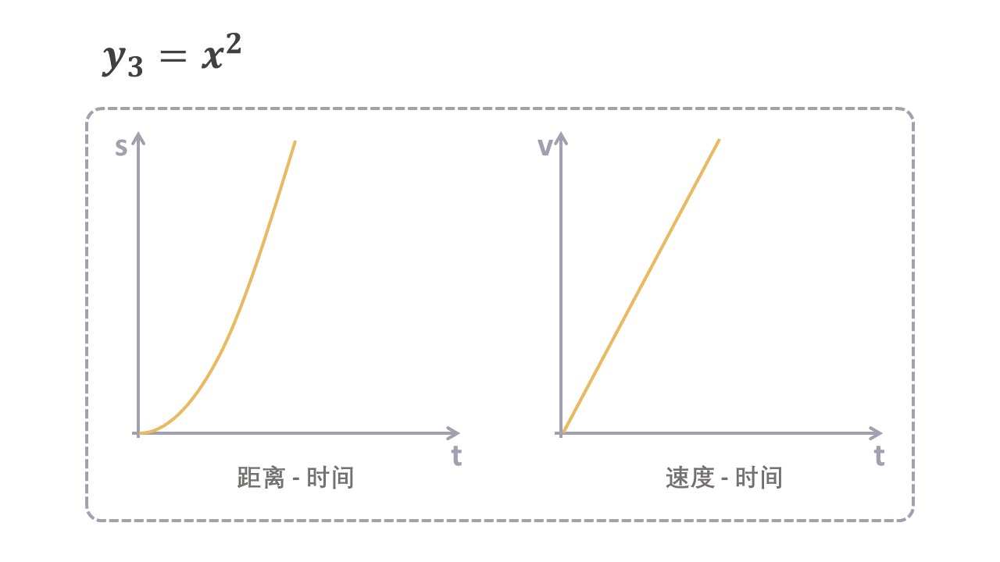

# 什么是大 O？

学过算法的朋友，对大 O（Big O）这个概念应该不陌生，它是用于计算算法复杂度的方法。

这个方法好像是伴随着算法而生的，在其他地方很少能够看到它。**你有没有思考过大 O 的本质到底是什么意思？** 反正我自己从来都没有完全弄清楚过。

最近正好在看一些介绍算法的书籍，自然也是绕不过这个概念的。这次我抱着试试心态，想搞明白大 O 到底是什么，最终还真有一些收获，所以决定写下来，希望和我有同样困惑的朋友能少走点弯路。

大 O 其实是一个数学上的概念，是由数学家巴赫曼在 1892 年引入，并由另外一名数学家兰道推广的。

**这篇文章我们就从数学上的大 O 开始，看看它是怎么成为算法复杂度分析方法的。**

## ⛓️ 无穷大

这一切都要从“无穷大”这个概念说起。

关于无穷大的介绍，《从一到无穷大》这本书里的一个例子最为生动，我们不妨来看看：

设想有一家旅店，内设有限个房间，而且房间都已客满。这时候来了位新客，想订房间。店主说：“对不起，所有客房都住满了。”

现在再设想另一家旅店，内设无限多个房间，所有房间也都客满。这时也来了为新客，想订房间。店主说：“没有问题！” 接着，他就把 `1` 号房间里的旅客移到 `2` 号房间，`2` 号房间的旅客移到 `3` 号房间，`3` 号房间的旅客移到 `4` 号房间，以此类推，这一来，新客就可以住进了被腾空的 `1` 号房间。


这个例子是不是有些颠覆我们对无穷大的理解？

之前我们可能就觉得“无穷大”就是一个很大很大的数，没有哪个数比它更大了。从这个例子中我们能感受到**无穷大不是一个静态的数，而是一个动态的趋势。**

## 🎢 趋势的变化

既然无限大是一种无限增加的趋势，那么如何判断一个无穷大比另一个无穷大增长的更快呢？

我们用几个无穷大的数组做为示例。

自然数：

`1，2，3，4，5，6，7，8，9，10...`

偶数：

`2，4，6，8，10，12，14，16，18，20...`

自然数的平方：

`1，4，9，16，25，36，49，64，81，100...`

当这些数组趋于无穷大的时候，我们不太方便用平铺的方式列出数值，这时候函数可以很好的解决这个麻烦。

自然数：`y1 = x` （x为正整数）

偶数： `y2 = 2x` （x为正整数）

平方： `y3 = x²` （x为正整数）

我们将函数画成图像就可以清晰地看出它们增大的趋势，`y1 < y2 < y3`。


上面的函数，正好可以用对应初中物理中的速度和加速度的内容（x为时间，单位s，y为距离，单位m）。

`y1 = x` ，对应着初速度为 `1(m/s)` 的匀速运动。


`y2 = 2x`，对应着初速度为 `2(m/s)` 的匀速运动。


`y3 = x²`，对应着初速度为 `0`，加速度为 `2(m/s²)` 的加速运动。



三个函数都在增大，**增大的趋势归根结底是速度变化的趋势**，所以 `y1` 和 `y2` 可以是一类趋势（匀速运动），`y3` 是另一类趋势（加速运动）。

如何才能更好的区分这些趋势类型呢？

数学上有个方法：用函数相比之后的结果来区分。

比如 `y1` 和 `y2`，当 `y1 / y2` 时，不管 `x` 变成多大，结果都是 `1/2`。**因此这种 `y1 / y2` 两个函数相比的结果是大于 `0` 的常数时，我们称这两个函数为同阶。**

如果用 `y3` 和 `y1` 相比，`y3 / y1` 结果为 `x`，当 `x` 趋于无穷大的时候，结果就是无穷大。 **因此这种 `y3 / y1`两个函数相比的结果是无穷大时，我们称 `y3` 是 `y1` 的高阶。**

## 🚀 大 O 的数学意义

数学上，对于同阶的函数最好能用一个统一的符号表示，这样我们就可以快速地看出一个函数处于哪个阶，这时候大 O 这个符号就可以登场了。

假设函数 `f(n)` 和 `g(n)` 属于同阶，那么肯定存在一个大于 0 的常量 `c`，使得 `f(n) / g(n) <= c`。这时候我们称 `f∈O（g）` 也可以写成 `f = O(g)`。

这有意义吗？表面上看这满足了 `f(n) <= c * g(n)` 这个公式的成立。

同时，这也意味着当 `n` 趋于无穷大时，对于函数 `f(n)`，任意的同阶函数 `g(n)` 乘以一个常量 `c` 都会满足 `f(n) <= c * g(n)`。此时函数 `c * g(n)` 就是 `f(n)` 的上界（也称渐进上界，因为 n 是逐渐地趋于无穷大的）。


**通常情况下，我们在写 `O(g)`时，`g` 函数会选择同阶函数中最简单的那个。**

比如，之前介绍的 `y1=x` 和 `y2=2x`，它们的大 O 写成 `O(x) `或者 `O(2x)` 都是正确，但是通常会选择最简单的那个 `O(x)`，所以这个阶中所有函数的大 O 都可以表示成 `O(x)`。

结合上面所说，**大 O 意义，就是用最简单的方式，快速标记一个函数的同阶上界。**

​你看，大 O 的数学概念是不是特别简单，简单到你翻开《高等数学》都看不到它的踪影。

## 🔬 函数的阶

之前例子中函数比较简单，我们来看一个复杂一点的函数:

 `y = 3x³ - 1000x² + 5x - 7`

我们先来确认一下这个函数的阶，用这个函数除以 `x³`。

$$\frac{3x^3 - 1000x^2 + 5x - 7}{x^3} = 3 - \frac{1000}{x} + \frac{5}{x^2} - \frac{7}{x^3}$$

当 `x` 趋于无穷大时，所有分母中包含 `x` 的数都趋于 0 ，因此计算结果为 `3`，所以函数 `y = 3x³ - 1000x² + 5x - 7` 的大 O 为 `O(x³)`。

来看看随着 `x` 的增大，`y` 的变化趋势。

|x|3x³|1000x²| 5x|7|y|
|:--|:--|:--|:--|:--|:--|
|100|三百万|一千万|500|7|≈ 负700万|
|1百万|三百万万亿|一千万亿|五百万|7|≈ 三百万万亿|

可以看到，当 `x` 等于 `100` 的时候，对 `y` 结果影响最大的还是 `1000x²`。

当 `x` 等于 `1百万` 时，`3x³` 以外的其他结果都可以忽略了。

从这个变化趋势我们可以看出，**当 `x` 趋于无穷大时，函数的结果只跟 `x` 最大次方的元素有关。**

知道了这层关系，不需要通过计算，也可以直接写出函数 `y = 3x³ - 1000x² + 5x - 7` 的大 O —— `O(x³)`。

这也进一步验证了之前的结论，**大 O 可以快速地找到同阶函数，并以此找出增长趋势的渐近上界。**

## 🎉 高德纳算法复杂度分析

我们暂时把目光转回到编程，思考一个问题：有没有一种公平的、一致的评判方法来对比不同算法的性能？

这个问题在计算机科学发展的早期，一直没有答案。

你想想在下面这两个场景下，你如何判断算法的好坏？

场景一：使用 1 万条数据进行测试，算法 A 运行 1 毫秒，算法 B 运行 10 毫秒。

场景二：使用 100 万条数据进行测试，算法 A 运行 10000 毫秒，算法 B 运行 6000 毫秒。

数据量少的时候，算法 A 表现好；数据量大的时候，算法 B 表现好。算法 A 和算法 B 到底哪个更好？这个问题换一种问法就是：**如何制定一个标准来判断算法的好坏？**

1965 年 Juris Hartmanis 和 Richard Stearns 首先提出了算法复杂的的概念，科学家们开始思考这个问题。最终，**高德纳找到了方法将算法复杂度严格量化衡量，他也因此被称为“算法分析之父”。**

是的，就是那个写出《计算机程序设计艺术》的大牛——**高德纳**。


高德纳算法复杂度分析的主要思想有两点：

1. **在比较算法快慢的时候，只需要考虑数据量特别大，大到无穷大的情况。**
为什么要考虑无穷大？因为计算机的发明就是为了处理大量数据的，而且数据会越来越多。

2. 决定算法快慢的因素虽然有很多，但是所有的因素都可以被分为两类： 第一类是不随数据变化的因素，第二类是随数据变化的因素。**衡量算法好坏时，只需要考虑随数据变化到近乎无穷大的情况。**

看到无穷大、变化趋势这些概念你会联想到什么？没错——大 O。这个在数学上不太起眼的概念，通过高德纳的搭线，从此在计算机科学领域大放异彩。

看一段函数复杂度的计算的例子：

```java
int cal (int n) {
    int sum = 0;    //1 Unit_Time
    int i = 1;      //1 Unit_Time

    for (i = 1; i <= n; i++){   //1 Unit_Time
        sum = sum + i;          //1 Unit_Time
    }

    return sum;     //1 Unit_Time
}
```

假设每条语句的运行时间都是相同的 1 个 时间单位（Unit_Time），这时候就可以通过计算语句运行的次数来获取运行的时间：

1. `for` 循环之外有 3 条语句，时间是 `3 * Unit_Time`
2. `for` 循环本身算一条语句，运行 n 次，s时间是 `n * Unit_time`
3. `for` 循环内部有一条语句，运行 n 次，时间是 `n * Unit_time`

最终，总的时间为 `(3 + 2n) * Unit_Time`。

`2n + 3` 的大 O 是多少？通过之前数学概念的介绍，我们可以很快的得出 `O(n)`。

如果你熟悉大 O 的数学概念，就会知道它只记录 `n` 所在的最高阶，所以不需要向上面这样考虑每条语句，直接从 `n` 趋于无穷大的循环中就可以得出结果。

## 🎨 常见的算法复杂度

常见的算法复杂度有 `O(n)`、`O(log(n))`、`O(n²)`、`O(nlog(n))` 等。


### O(n) 

```java
for (int i = 1; i <= n; i++)
{
    //some O(1) expressions
}
```

这跟之前的例子类似，循环会执行 `n` 次，算法的复杂度是 `O(n)`。

### O(n²)

```java
for(int i = 0; i < n; i++)
{
    for(int j = 0; j < n; j++)
    {
        //some O(1) expressions
    }
}
```

循环有两层，外面一层循环 `n` 次，其中的每次又都会在内层中循环 `n` 次，所以最终的算法复杂度是 `o(n²)`。

### O(log(n))
```java
for (int i = 1; i <= n; i = i*2)
{
    //some O(1) expressions
}
```

在上面的循环中，`i` 每次循环的值分别为：`1, 2, 4, 8, 16,...., 2^k` ，最终 `n = 2^k` 时停止，其中 `k` 就是循环的次数。这里使用对数 `log` 的概念， 求得 `k = log₂n`。

无论 `log` 的底是多少，根据换底公式 `log₃n = (log₃2 / log₂3) * log₂n`，都可以转换成 `c * log₂n`, 所以算法复杂度去掉了底数，写出 `O(logn)`。

### O(nlog(n))

```java
for(int i = 0; i < n; i++)
{
    for(int j = 0; j < n; j = j*2)
    {
        //some O(1) expressions
    }
}
```

这次是 `O(n)` 和 `O(logn)` 的结合，外层循环 `n` 次，其中每次又都会在内层中循环 `logn` 次，所以最终的算法复杂度是 `O(nlog(n))`。


## ✍️ 总结

著名数学家弗里曼.戴森曾经有一个形象的比喻：有些科学家像鸟，翱翔在高高的天空，俯瞰延伸至遥远地平线的广袤远景。他们喜欢那些统一我们思想、并将不同领域的诸多问题整合起来的概念。有些科学家像青蛙，生活在泥土里，只看到周围生长的花草。他们乐于探索特定问题的细节，一次只解决一个问题。

计算机科学的发展离不开这两类科学家的共同努力，而高德纳在这个领域就是那只鸟一样的科学家。他从算法复杂度的需求延伸出去，将数学领域的大 O 概念巧妙地整合到了算法领域。

也许你会听到大 O 算法复杂度有些许不足的讨论，但这些声音无法改变大 O 在评估算法复杂度方面的统治地位。

最后再补充一点，文章中介绍的算法复杂度，叫做时间复杂度，还有一种复杂度叫做空间复杂度，用于统计 n 趋于无限大时，所需要的内存空间的大小。

关于算法复杂度具体的应用，我们会在之后介绍排序算法历史的文章中详细讲解，到时候我们一起来聊聊科学家们是如何探索特定问题的细节，并解决问题的。

---


WWH 系列文章列表：

[1] [Why - 为什么说 JavaScript 更像一门编译型语言](https://mp.weixin.qq.com/s?__biz=MzI5NjA1MDQ4NA==&mid=2454608234&idx=1&sn=5b2b7c62d18f01ce5dfa7607bc86a12b&chksm=fbf0b331cc873a275a5f3d42081549feb668e9d1beea7ce78125c0a547728a9cb262ff266194&scene=21#wechat_redirect)

[2] [What - What - 什么是依赖注入💉？](https://mp.weixin.qq.com/s?__biz=MzI5NjA1MDQ4NA==&mid=2454608405&idx=1&sn=5237d417b8a7d26ff11a7fea13c42f3d&chksm=fbf0b04ecc873958d4c0764d0bf2552da9ebd36cac39b4222af1c47fcca562b8a772561146fb&token=973806712&lang=zh_CN#rd)

参考资料：

[1] https://home.csulb.edu/~tebert/teaching/lectures/328/bigO/bigO.pdf

[2] https://tandy.cs.illinois.edu/big-oh.pdf

