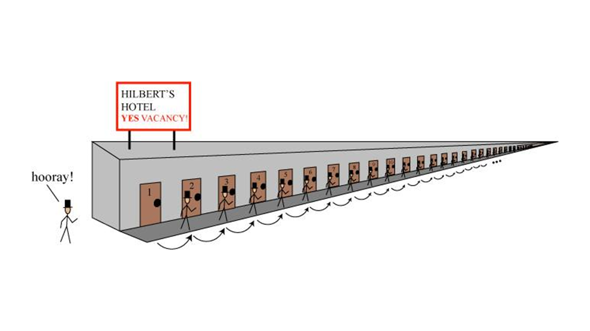

# 什么是大 O

1. 无穷大
2. 趋势变化（阶 / 求导）
3. 大 O 的数学意义（渐进上界）
4. 计算运行的次数
5. 高德纳算法分析方式
6. 算法复杂度意义
7. 常见的算法复杂的（log）

https://home.csulb.edu/~tebert/teaching/lectures/328/bigO/bigO.pdf
https://tandy.cs.illinois.edu/big-oh.pdf

开始

当年学习数据结构的时候，老师就讲过算法的时间复杂度是用大 O (big O)来表示。但是大 O 到底是什么意思，我好像从来都没有完全弄清楚过。回想起来，这可能也是我一直没有学好算法的原因之一。就像拿到一本武功秘籍，第一句话就是“欲练此功 ****”，然后就没有然后了。

最近正好在看一些介绍算法的书籍，自然也是绕不过这个概念的。这次我抱着试试心态，想搞明白大 O 到底是什么意思，最终还真得到了一些收获，所以决定写下来，希望和我有同样困惑的朋友能少走点弯路。

大 O 其实是一个数学上的概念，在分析算法复杂度的时候正好借用了这个概念。

这篇文章我们就从数学上的大 O 开始，看看它为什么会成为算法复杂度的分析方法。

## 无穷大

这一切都要从“无穷大”这个概念说起。我知道的关于无穷大的介绍中，《从一到无穷大》这本书里的一个例子最为生动，我们不妨来看看：

设想有一家旅店，内设有限个房间，而且房间都已客满。这时候来了位新客，想订房间。店主说：“对不起，所有客房都住满了。”

现在再设想另一家旅店，内设无限多个房间，所有房间也都客满。这时也来了为新客，想订房间。店主说：“没有问题！” 接着，他就把 1 号房间里的旅客移到 2 号房间，2 号房间的旅客移到 3 号房间，3 号房间的旅客移到 4 号房间，以此类推，这一来，新客就可以住进了被腾空的 1 号房间。

<figure>
    
</figure>

这个例子是不是有些颠覆你对无穷大的理解。之前我们可能就觉得“无穷大”就是一个很大很大的数，没有哪个数比他大。从这个例子中我们能感受到“无穷大”不是一个静态的数，而是一个动态的趋势。

## 趋势的变化

既然无限大是一种无限增加的趋势，那么如何判断一个无穷大比另一个无穷大增长的更快呢？

我们用几个无穷大的数组做为示例。

自然数：
1，2，3，4，5，6，7，8，9，10...

偶数：
2，4，6，8，10，12，14，16，18，20...

自然数的平方：
1，4，9，16，25，36，49，64，81，100...

当这些数组趋于无穷大的时候，我们不太方便用平铺的方式列出数值，这时候函数可以很好的解决这个麻烦。

自然数：y1 = x （x为正整数）

偶数： y2 = 2x （x为正整数）

平方： y3 = x^2 （x为正整数）

我们将函数画成图像就可以清晰地看出它们增大的趋势，y1 < y2 < y3。

<figure>
    
</figure>

上面的函数，正好可以用对应初中物理中的速度和加速度的内容（x为时间，单位m，y为距离，单位m）。

y1 = x ，对应着初速度为 1 (m/s)的匀速运动。

y2 = 2x，对应着初速度为 2 (m/s)的匀速运动。

y3 = x^2，对应着初速度为 0，加速度为 2 （m/s^2）的加速运动。

三个函数都在增大，增大的趋势归根结底是速度变化的趋势，所以 y1 和 y2 可以是一类趋势（匀速运动），y3 是另一类趋势（加速运动）。

如何才能更好的区分这些趋势类型呢？

数学上有个方法：用函数相比之后的结果来区分。

比如 y1 和 y2，当 y1 / y2 时，不管 x 变成多大，结果都是 1/2。因此这种 y1 / y2 两个函数相比的结果是大于 0 的常数时，我们称这两个函数为同阶。

如果用 y3 和 y1 相比，y3 / y1 结果为 x，当 x 趋于无穷大的时候，结果就是无穷大。因此这种 y3 / y1 两个函数相比的结果是无穷大时，我们称 y3 是 y1 的高阶。

## 大 O 意义

数学上，对于同阶的函数最好能用一个统一的符号表示，这样我们就可以快速地看出一个函数处于哪个阶。这时候大 O 这个符号就可以登场了。

假设函数 f(n) 和 g(n) 属于同阶，那么肯定存在一个大于 0 的常量 c，使得 f(n) / g(n) <= c。这时候我们称 `f∈O（g）` 也可以写成 `f = O(g)`。

这有意义呢？表面上看这满足了 `f(n) <= c * g(n)` 这个公式的成立。

同时这也意味着，当 n 趋于无穷大时，对于函数 f(n)，任意的同阶函数 g(n) 乘以一个常量 c 都会满足 `f(n) <= c * g(n)`。此时函数 `c * g(n)` 就是 f(n) 的上界（也称渐进上界，因为 n 是逐渐地趋于无穷大的）。

<figure>
    
</figure>

通常情况下，我们在写 O（g）时，g 函数会选择同阶函数中最简单的那个。

比如之前介绍的 `y1=x` 和 `y2=2x`，写成 O(x) 或者 O(2x) 都正确，但是通常会选择最简单的那个 `O(x)`，所以这个阶中所有函数的大 O 都可以表示成 `O(x)`。

结合上面所说，我理解的大 O 意义，就是用最简单的方式，快速标记一个函数的同阶上界。

## 数学实践

之前例子中函数比较简单，我们来看一个复杂一点的函数 y = 3x^3 - 1000x^2 + 5x -7。

我们先来确认一下这个函数的阶。用这个函数除以 x^3。

`(3x^3 - 1000x^2 + 5x -7)/x^3 = 3 - 1000/x + 5/x^2 -7/x^3`

当 x 趋于无穷大时，所有分母中包含 x 的数都趋于 0 ，因此计算结果为 3，所以函数 `y = 3x^3 - 1000x^2 + 5x -7` 的大 O 为 O(x^3)。

我们来看看随着 x 的增大，y 的变化趋势。

|x|3x^3|1000x^2| 5x|-7|y|
|:--|:--|:--|:--|:--|:--|
|100|三百万|一千万|500|-7|≈ 负700万|
|1百万|三百万万亿|一千万亿|五百万|-7|≈ 三百万万亿|

可以看到，当 x 等于 100 的时候，对 y 结果影响最大的还是 `1000x^2`。

当 x 等于 1百万 时，3x^3 以外的其他结果都可以忽略了。

从这个变化趋势我们可以看出，当 x 趋于无穷大时，函数的结果只跟 x 最大次方的元素有关。

知道了这层关系，不需要计算，就可以直接写出函数 `y = 3x^3 - 1000x^2 + 5x -7` 的大 O —— O(x^3)。

这也进一步验证了之前的结论，大 O 可以快速地找到同阶函数，并以此找出增长趋势的渐近上界。

